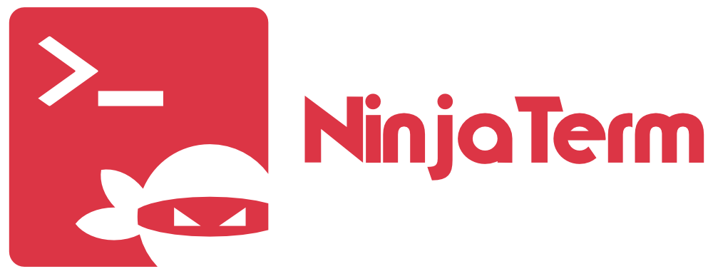

<p align="center"></p>

#### A serial port terminal that's got your back.

<br>

<br>

<div align="center">

[![Build Status][github-actions-status]][github-actions-url]
[![Github Tag][github-tag-image]][github-tag-url]

</div>

## Install

NinjaTerm is now a PWA (Progressive Web App). Just visit [https://ninjaterm.mbedded.ninja](https://ninjaterm.mbedded.ninja) to open the app. Click the install button if you want to install in locally and be able to use it offline.

You can also access older versions of NinjaTerm at [GitHub Releases](https://github.com/gbmhunter/NinjaTerm/releases).

## Development

Clone this repo. Then run `npm install` to install dependencies:

```bash
npm install
```

Start the app in the `dev` environment:

```bash
npm start
```

## Testing

Arduino sketches in `arduino-serial` allow you to program different applications onto an Arduino for testing the serial port with.

## Releasing

1. Update the version number in `package.json`.
1. Update the CHANGELOG.
1. Create pull request merging `develop` into `main`.
1. Once the build on `develop` has been successfully run, merge the `develop` branch into `main` via the merge request.
1. Tag the branch on main with the version number, e.g. `v4.1.0`.
1. Create a release on GitHub pointing to the tag.
1. Enter the CHANGELOG contents into the release body text.
1. Checkout the `develop` branch and fast-forward it to the new commit on `main`.

## Deployment

Netlify is used to deploy and host the static NinjaTerm HTML/JS.

## Code Architecture

Create React App (CRA) with the typescript PWA template [docs here](https://create-react-app.dev/docs/making-a-progressive-web-app/) was used as a starting point for development:

```bash
npx create-react-app my-app --template cra-template-pwa-typescript
```

MobX is used to store the application state. The application model is under `src/model/`.

## GitHub Pages

The `docs/` folder contains the source code for the NinjaTerm homepage, hosted by GitHub Pages. This is automatically build and deployed with new commits pushed to `main`.

## Theme Colors

* DC3545 (red): Primary colour, used for logo.

## Extensions

* Prettier ESLint: Provides formatting of .tsx files.

[github-actions-status]: https://github.com/gbmhunter/NinjaTerm/workflows/Test/badge.svg
[github-actions-url]: https://github.com/gbmhunter/NinjaTerm/actions
[github-tag-image]: https://img.shields.io/github/tag/gbmhunter/NinjaTerm.svg?label=version
[github-tag-url]: https://github.com/gbmhunter/NinjaTerm/releases/latest
