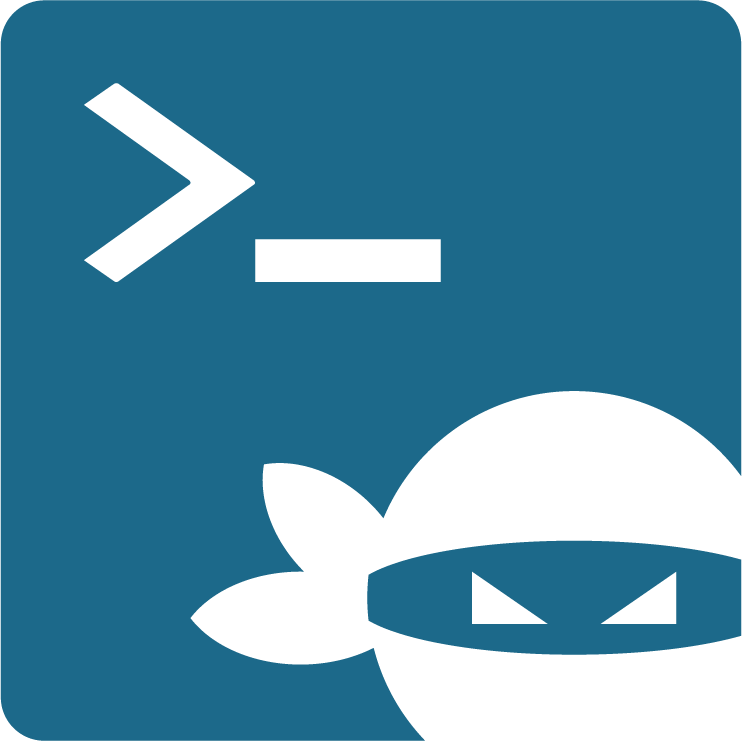

<p align="center"></p>

<br>

<br>

<div align="center">

[![Build Status][github-actions-status]][github-actions-url]
[![Github Tag][github-tag-image]][github-tag-url]

</div>

## Install

Dependencies:

1. `npm`
1. `yarn`
1. `git`

```bash
git clone
yarn
```

## Development

Start the app in the `dev` environment:

```bash
yarn start
```

Note: Icon in development will default to Electron icon even though NinjaTerm icon will be used when packaging for releases, see [https://github.com/electron-react-boilerplate/electron-react-boilerplate/issues/1710#issuecomment-414199480](https://github.com/electron-react-boilerplate/electron-react-boilerplate/issues/1710#issuecomment-414199480).

**Running Lint Checks**

```bash
yarn lint
```

**Running Typescript Checks**

```bash
yarn tsc
```

## Packaging for Production

To package apps for the local platform:

```bash
yarn package
```

Packages are created in the `release` directory. Because the native module `serialport` is used, each package has to be built on it's respective platform.

Packaging is performed by the `electron-builder` library. The config for this is contained within the top-level `package.json` under `"build"`.

Version number is contained within the "inner" `package.json` at `src/package.json`.

## Maintainers

- [Geoffrey Hunter](https://github.com/gbmhunter)

## License

MIT © [gbmhunter](https://github.com/gbmhunter)

[github-actions-status]: https://github.com/gbmhunter/ninjaterm-electron/workflows/Test/badge.svg
[github-actions-url]: https://github.com/gbmhunter/ninjaterm-electron/actions
[github-tag-url]: https://github.com/gbmhunter/ninjaterm-electron/releases/latest
